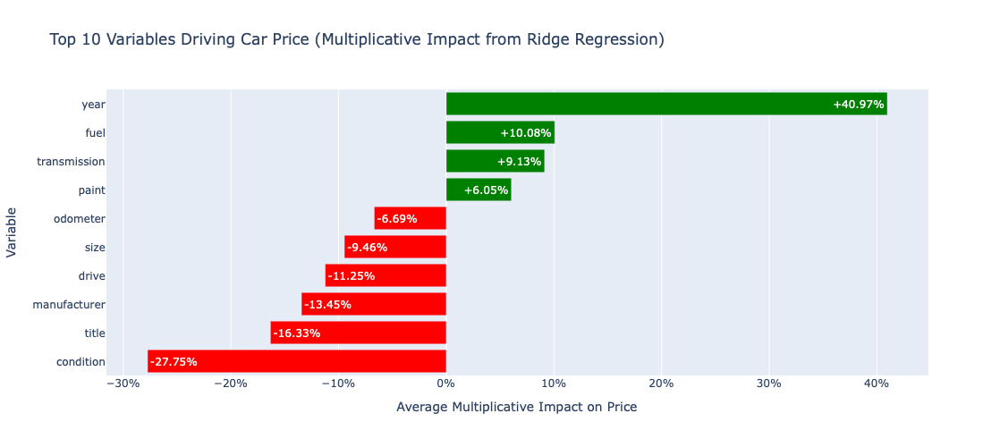

# Required Assignment 11.1: What Drives the Price of a Car?

This required assignment for Module 11: Practical Application centers on applying the CRISP-DM framework to a real-world business problem. The objective of this activity is to analyze and determine the key factors influencing the question: “What drives the price of a car?”

**Jupyter Notebook Assignment Link:** 
https://github.com/marlonkolivas/practical_application_two/blob/main/practical_application_two.ipynb

# CRISP-DM Deployment Report: Optimizing Used Car Inventory Pricing

**Date:** 09-18-2025  
**Audience:** Used Car Dealership Management

## Overview

This project applies the CRISP-DM framework to improve pricing strategies for a used car inventory. Machine learning models were developed to predict market prices based on key vehicle features.

## Key Findings

**Best Model:** Ridge Regression outperformed Linear and Lasso models, providing the most accurate price predictions and explaining the highest variance in car prices.
See chart below:

**Top Positive Price Drivers:**

- Year (+40.97%)
- Fuel type (+10.08%)
- Transmission (+9.13%)
- Paint/color (+6.05%)

**Top Negative Price Drivers:**

- Condition (-27.75%)
- Title status (-16.33%)
- Manufacturer (-13.45%)
- Drive type (-11.25%)
- Vehicle size (-9.46%)
- Odometer/mileage (-6.69%)

## Recommendations

1. **Inventory Acquisition:** Prioritize newer vehicles with desirable features, clean condition, and title. Avoid vehicles with high negative impacts.
2. **Strategic Pricing:** Use model insights to set competitive, data-driven prices for current inventory.
3. **Training & Support:** Equip sales and management teams to interpret and leverage model outputs.

## Next Steps

- **Pilot Program:** Test the model on a portion of inventory for 30 days.
- **Feedback Loop:** Gather real-world performance data to refine and improve the model.
